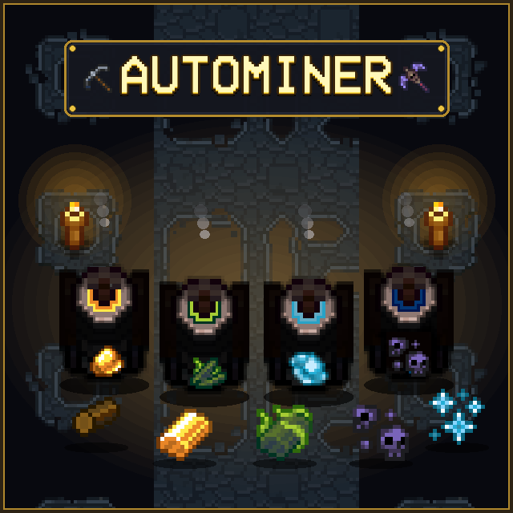

# Autominer Fix



An automated mining and resource generation mod for **Necesse** (v1.3.2+).

Adds placeable automated miners for over 55 ores, gems, stone types, mob drops, and endgame crafting materials.

## Features

- **55+ Automated Miners**: Covers early-game stones and ores up to endgame materials and shards.
- **Tier-Based Unlocks**: Miners are crafted across progression workstations (Workstation, Demonic Workstation, Tungsten Workstation, Fallen Workstation).
- **Configurable Fuel System**: Optional wood fuel requirement with configurable burn duration.
- **Configurable Speed**: Adjustable mining speed multiplier (1x to 5x).
- **In-Game Settings**: Configurable via [CustomSettingsLib](https://steamcommunity.com/sharedfiles/filedetails/?id=3440421710) GUI (`Settings` → `Mod Settings` → `AutoMiner`).
- **Chat Command Fallback**: Control settings in-game via `/autominer` without extra mods.
- **Multi-language Support**: English (`en`), Korean (`kr`), German (`de`), and Spanish (`es`).

## Miner Progression

### Tier 1: Workstation
- **Earth & Blocks**: Stone, Clay, Sand, Sandstone, Snowstone, Swampstone
- **Ores**: Copper Ore, Iron Ore, Gold Ore, Frost Shards
- **Gems**: Amethyst, Topaz, Emerald, Sapphire, Ruby, Diamond, Amber
- **Mob Drops**: Bat Wing, Bone, Silk, Wool, Cloth Scraps

### Tier 2: Demonic Workstation
- **Minerals**: Ivy Ore, Quartz, Spiderite Ore, Life Quartz
- **Essences & Drops**: Void Shard, Ectoplasm, Phantom Dust, Blood Essence, Slime Essence, Slime Matter, Slimeum, Spider Essence, Spider Venom, Cave Spider Gland, Spider Stone, Worm Carapace

### Tier 3: Tungsten Workstation
- **Deep Stones**: Deep Stone, Deep Sandstone, Deep Snowstone, Deep Swampstone, Granite, Basalt, Runestone
- **Deep & Glacial Ores**: Tungsten Ore, Obsidian, Glacial Ore, Glacial Shard, Ancient Fossil Ore, Mycelium Ore, Nightsteel Ore

### Tier 4: Fallen Workstation
- **Endgame Materials**: Upgrade Shards, Alchemy Shards, Altar Dust, Omnicrystal

## Configuration

### In-Game UI (via CustomSettingsLib)
If [CustomSettingsLib](https://steamcommunity.com/sharedfiles/filedetails/?id=3440421710) is installed, navigate to **Settings** → **Mod Settings** → **AutoMiner**:
- **Require Wood Log Fuel**: Toggle fuel requirement (Default: `ON`).
- **Mining Speed Multiplier**: Adjust production rate (1x - 10x).
- **Fuel Duration Multiplier**: Adjust fuel burn duration (1x - 10x).
- **Enable Endgame Miners**: Toggle Tier 4 miners (Default: `ON`).

### Chat Commands
Settings can also be modified using chat commands:
- `/autominer status` — Show current configuration.
- `/autominer fuel <true|false>` — Toggle fuel requirement.
- `/autominer speed <1-10>` — Set mining speed multiplier.
- `/autominer fuelduration <1-10>` — Set fuel duration multiplier.
- `/autominer endgame <true|false>` — Toggle endgame miners.

## Installation

### Steam Workshop
1. Subscribe to the mod on the Steam Workshop.
2. (Optional) Subscribe to **CustomSettingsLib** for the in-game settings GUI.
3. Enable both in the Necesse **Mods** menu.

### Manual Installation
1. Download the latest `.jar` from Releases.
2. Place the file into your Necesse `mods/` directory:
   - **Windows**: `%APPDATA%/Necesse/mods/`
   - **macOS**: `~/Library/Application Support/Necesse/mods/`
   - **Linux**: `~/.config/Necesse/mods/`
3. Enable the mod in the in-game **Mods** menu.

## Building from Source

Requires JDK 17+.

```bash
# Clone repository
git clone https://github.com/mahardikamaulana/autominer.git
cd autominer

# Build JAR
./gradlew buildModJar

# Build and copy directly to local Necesse mods directory
./gradlew copyMod
```

## Credits

- **Original Mod**: KKDJ20, Agath, Mako
- **Maintainer**: Xeraphire
- **License**: [MIT](LICENSE)
